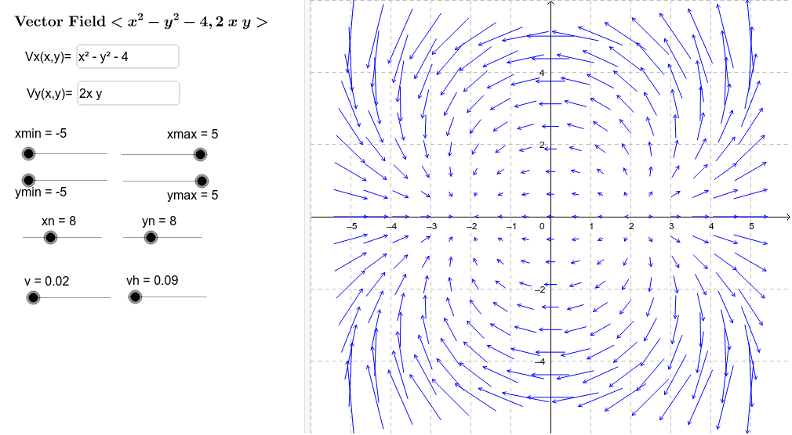
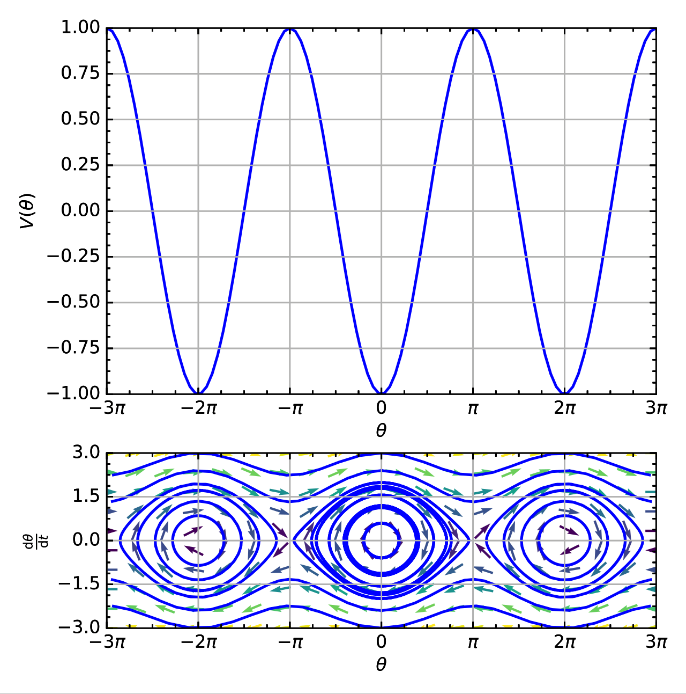
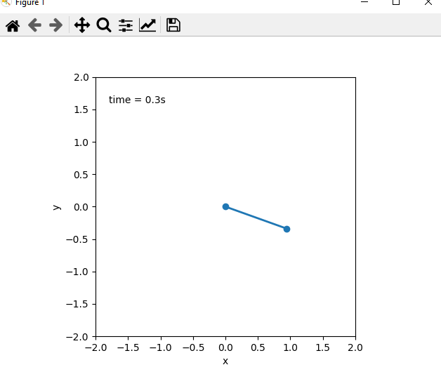

# Vector fields and phase portraits

A vector field associated each point in the state-space with a vector represented by an arrow.
This arrow indicates how the system will evolve within the next timestep.
Intuitively, we can think of each this as a force-field that is pushing particles around.

The appearance of the vector field indicates the dynamics of the system.
For instance if all arrows converge on a single point, it tells us that the system is stable, since any state will eventually reach the point where the arrows point.



A phase portrait can be drawn by taking several points, and tracing the trajectory they move in.
The result of this is a set of solid lines rather than set of arrows.
The phase portrait below corresponds to a ideal gravity pendulum.



# Vector Fields using Fieldplay

The following is GLSL, a language similar to C. We will use it to visualize how each state of a dynamical system evolves over time. I.e. if the robot is at a certain angle and has a certain angular velocity, where will it be an infinitely small step into the future.
This result is similar to a _phaseportrait_ only that instead of arrows, we get particles moving around.

We will use the _fieldplay_ app to visualize how the state of a pendulum


```GLSL
// p.x and p.y are current coordinates
// v.x and v.y is a velocity at point p
vec2 get_velocity(vec2 p) {
  vec2 v = vec2(0., 0.);

  // change this to get a new vector field
  v.x = p.y;
  v.y = -cos(p.x);

  return v;
}
```

https://www.google.com/url?sa=t&rct=j&q=&esrc=s&source=web&cd=&cad=rja&uact=8&ved=2ahUKEwizwduF0573AhUhiIsKHXn-AMEQFnoECBAQAQ&url=https%3A%2F%2Fanvaka.github.io%2Ffieldplay%2F&usg=AOvVaw2lCfMcVmL7uC0SW97mE08w

## Exercise

1. Add variables for the mass, length of pendulum arm and the acceleration of gravity. Update the assignment expression `v.y = ...` to account for these

2. Try to adjust the values of the different constant and discuss their influence on the vector field.

3. Add a term to account for friction, assume that the friction is proportional to the velocity.

# Co-Simulation in Python

In this exercise we investigate how a co-simulation of the robotic arm system can be set up using Python.
The goal is to get an understanding of the work involved to write a simulation loop that steps more than one model.

We start from a single script `cosim.py` and then move to an object oriented approach that is more similar to the concept of FMUs in the `cosim_oop.py`, `controller_oop.py` and `robot_arm.py` scripts.



The code uses numpy and matplotlib which can be installed with pip by running the following command in the root of the repo:

```python
python -m pip install -r requirements.txt
```

## Exercise

1. Execute the `cosim.py` script. The result is a plot followed by an animation of the pendulum.
2. Read the code and add your own comments describing the significance of each region of code.
3. Modify the output torque of the controller to a different value. How does it influence the movement of the robot arm?
4. Run the `cosim_oop.py` script. Are there any differences between this and the previous script?
5. Read the code of the script and add comments describing the differences between the two scripts.
6. Modify the `step` function of the `Controller` class such that the output torque will result in a closed loop system that converges to the desired setpoint.
